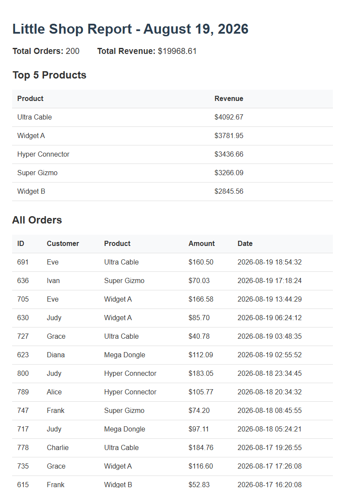

# PDF Report Generator

This project implements a complete data pipeline that transforms raw database records into a formatted, paginated PDF report. It utilizes Python, FastAPI, SQLite, and Playwright to aggregate SQL data into a JSON response, render it as HTML/CSS, and generate a final PDF document via a headless Chromium instance.

## Dataset Overview
**Option A — The Little Shop:** This implementation utilizes a local SQLite database (`report.db`) containing an `orders` table. The database is seeded with 200 randomized records including products, transaction amounts, customer names, and timestamps.

## Usage Instructions

1. **Seed the Database**
   Execute the seeding script to populate `report.db` with sample data. The script is idempotent and resets the table before inserting new records:
   ```bash
   python seed.py
   ```

2. **Start the API Server**
   Launch the FastAPI application on port 8000:
   ```bash
   python -m uvicorn main:app --port 8000
   ```

3. **Generate a Report**
   Issue a `POST` request to generate the report, followed by a `GET` request to download the resulting PDF:
   ```bash
   curl -i -X POST http://localhost:8000/reports
   curl -o my-report.pdf http://localhost:8000/reports/1/file
   ```

## Aggregation Queries

The following SQL queries are utilized to calculate the core report metrics:

```sql
-- Total number of orders
SELECT COUNT(*) as total_orders FROM orders

-- Total revenue
SELECT SUM(amount) as total_revenue FROM orders

-- Top 5 products by revenue
SELECT product, SUM(amount) as revenue 
FROM orders 
GROUP BY product 
ORDER BY revenue DESC 
LIMIT 5

-- Orders per day for the last 7 days
SELECT DATE(created_at) as order_date, COUNT(*) as order_count 
FROM orders 
WHERE DATE(created_at) >= ?
GROUP BY order_date
ORDER BY order_date DESC
```

## API Validation (POST → Download)

The `POST` endpoint processes the data and generates the PDF synchronously. Upon completion, it returns the resource ID and download link:

```text
$ time curl -i -X POST http://localhost:8000/reports
HTTP/1.1 201 Created
server: uvicorn
content-type: application/json

{"id":1,"file":"/reports/1/file"}
(Completed in ~1.83s)

$ curl -o my-report.pdf http://localhost:8000/reports/1/file
  % Total    % Received % Xferd  Average Speed   Time    Time     Time  Current
                                 Dload  Upload   Total   Spent    Left  Speed
100 66624  100 66624    0     0  3.1M      0 --:--:-- --:--:-- --:--:--  3.1M
```

## Architecture Notes

### Moving PDF Generation to Background Jobs
PDF generation should be moved to a background job when the report requires more than a few seconds to process, or when the endpoint experiences high concurrent usage. Long-running synchronous requests tie up API server connections and degrade the user experience by blocking the client without providing progress feedback.

### Idempotency Requirements
The report generation endpoint includes an idempotency check to verify if a report has already been created for the current day. If a report exists, it returns the existing resource immediately rather than duplicating the generation process. This constraint prevents a single client from accidentally triggering resource-intensive or side-effect-heavy tasks multiple times. In real-world applications, omitting this check can result in financial loss, such as processing a payment transaction twice or sending duplicate automated communications to customers.

## Output Example


